# Install an Openshift cluster with Terraform and PowerVC

## Check the environment

* Activate your openvpn.
* To check it is working properly, make sure you can access the PowerVC : <https://powervc.paris.edu.ihost.com:4443>.
* The manager's ip (that hosts the terraform) is 10.3.48.3
to access it :

```sh
ssh your_provided_user@10.3.48.3 
```

```text
password : your_provided_password
```

The terraform runs on the manager's vm (distinct from the VM on which the PowerVC runs).
It takes the var.tfvars file in input and will generate a tfstate file.

The ansible playbooks (1) and (2) will be on the bastion once it is deployed. They will run to automatically create the cluster as stated in the tfstate file.

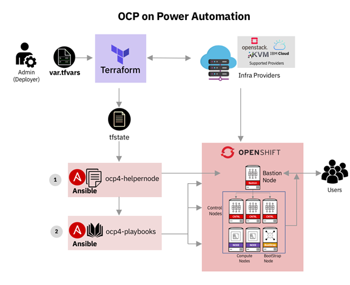

The ansible helpernode playbook will prepare the bastion for the cluster and will set its environment.
The other ansible playbook will be generated next and will set the nodes to create the cluster.

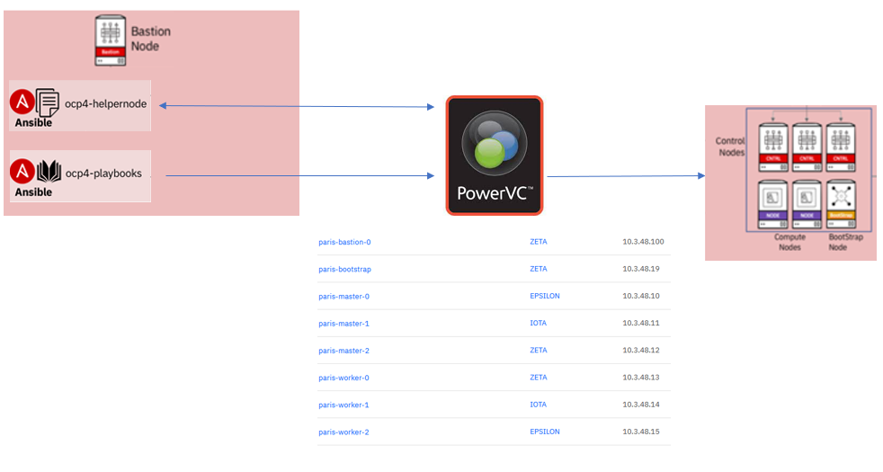

## 1) Cluster installation

Now, we can clone the git repository.

```sh
git clone https://github.com/ocp-power-automation/ocp4-upi-powervm
```

```text
Cloning into 'ocp4-upi-powervm'...
remote: Enumerating objects: 1732, done.
remote: Counting objects: 100% (448/448), done.
remote: Compressing objects: 100% (186/186), done.
remote: Total 1732 (delta 284), reused 398 (delta 262), pack-reused 1284
Receiving objects: 100% (1732/1732), 424.05 KiB | 2.08 MiB/s, done.
Resolving deltas: 100% (1038/1038), done.
```

```sh
ls
```

```text
ocp4-upi-powervm 
```

We now have to work in the `ocp4-upi-powervm` directory :

```sh
cd ocp4-upi-powervm
```

Copy the customized `.tfvar` sample :

```sh
cp /home/samples/sample_demo.tfvars ~/ocp4-upi-powervm/paris.tfvars
```

Initialize the terraform plugins and modules for you environment :

```sh
terraform init -plugin-dir /usr/local/terraform/
```

Both the Openshift pull-secret and the ssh key-pair have to be copied in the `ocp4-upi-powervm/data` directory.

Your personnal Openshift pull secret, is available at :

[https://cloud.redhat.com/openshift/install/power/user-provisioned](https://console.redhat.com/openshift/install/power/user-provisioned)

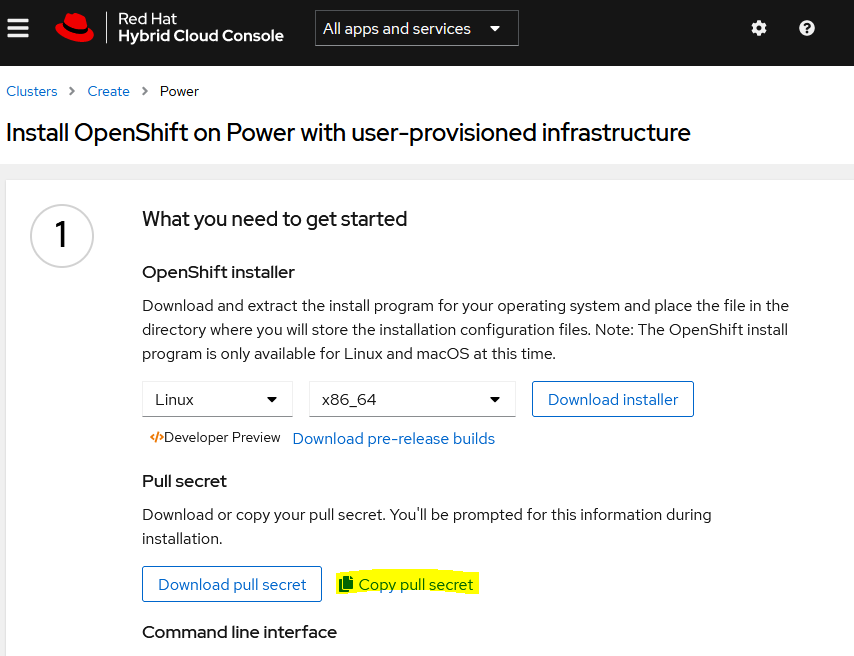

Once copied, you can insert it in the `data/pull-secret.txt` file.

```sh
vi ~/ocp4-upi-powervm/data/pull-secret.txt
```

Create an ssh key, and copy it into the `data` directory

```shell
ssh-keygen -q -t rsa -N '' -f ~/.ssh/id_rsa
```

Enter *y* to overwrite any existing key-pair :

```text
/home/id86c7d6e/.ssh/id_rsa already exists.
Overwrite (y/n)?
```

Copy the newly created key-pair to the *data* directory, and check the files :

```sh
cp ~/.ssh/id_rsa* ~/ocp4-upi-powervm/data/
ls ~/ocp4-upi-powervm/data/
```

Now, you have to edit the terraform configuration `paris.tfvars` file. The minimum requirement is to accomodate the user and password as
they have been provided to you by Techzone.
You can find how to customize the terraform customization here: [customize the tfvar file](tfvars.md)

```sh
vi paris.tfvars
```

You can now start the terraform deployment :

```sh
terraform apply -var-file paris.tfvars
```


Answer *yes* when prompted :

```
Do you want to perform these actions?
  Terraform will perform the actions described above.
  Only 'yes' will be accepted to approve.
```


The terraform script starts creating the VMs as specified in the demo.tfvars file.

## 2) Monitoring the installation

The terraform script first builds the bastion an will try to ssh in order to ssh
it to continue with the installation. It may take around 5 minutes to get the bastion ready :

```text
module.bastion.null_resource.bastion_init[0]: Still creating... [4m0s elapsed]
module.bastion.null_resource.bastion_init[0] (remote-exec): Connecting to remote host via SSH...
module.bastion.null_resource.bastion_init[0] (remote-exec):   Host: 10.3.48.100
module.bastion.null_resource.bastion_init[0] (remote-exec):   User: root
module.bastion.null_resource.bastion_init[0] (remote-exec):   Password: false
module.bastion.null_resource.bastion_init[0] (remote-exec):   Private key: true
module.bastion.null_resource.bastion_init[0] (remote-exec):   Certificate: false
module.bastion.null_resource.bastion_init[0] (remote-exec):   SSH Agent: false
module.bastion.null_resource.bastion_init[0] (remote-exec):   Checking Host Key: false
```

Until the terraform script can successfully connect :

```text
module.bastion.null_resource.bastion_init[0]: Creation complete after 5m26s [id=7156080057483097683]
module.bastion.null_resource.enable_repos[0]: Creating...
module.bastion.null_resource.enable_repos[0]: Provisioning with 'remote-exec'...
module.bastion.null_resource.enable_repos[0] (remote-exec): Connecting to remote host via SSH...
module.bastion.null_resource.enable_repos[0] (remote-exec):   Host: 10.3.48.100
module.bastion.null_resource.enable_repos[0] (remote-exec):   User: root
module.bastion.null_resource.enable_repos[0] (remote-exec):   Password: false
module.bastion.null_resource.enable_repos[0] (remote-exec):   Private key: true
module.bastion.null_resource.enable_repos[0] (remote-exec):   Certificate: false
module.bastion.null_resource.enable_repos[0] (remote-exec):   SSH Agent: false
module.bastion.null_resource.enable_repos[0] (remote-exec):   Checking Host Key: false
module.bastion.null_resource.enable_repos[0] (remote-exec): Connected!
```

The bastion shows up in PowerVC as well :

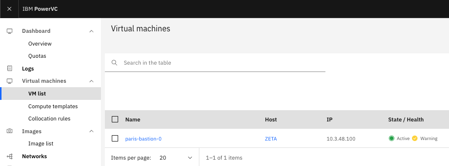

### a) command lines on the bastion

Once the apply command is launched, we need to wait for the bastion to be fully deployed.
One can see the progress of the install of the bastion on PowerVC. For that, see Virtual Machines -> VM list.
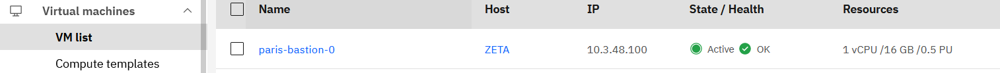

The ip adress of the bastion is specified in the `paris.tfvars` file, as well as in PowerVC (vm list, network column). 
You first need to open a new ssh session to ***10.3.48.3*** with your credentials :

```sh
ssh your_provided_user@10.3.48.3 
```

```text
password : your_provided_password
```

Then, ssh to `10.3.48.100`, and access the bastion with ssh once it is properly deployed.
you don't need any passwd, since the terraform script has installed it's public key onto the bastion.

```sh
ssh root@10.3.48.100
```

>:warning: The openstack repository might take some time to be created (the helpernode and then the playbooks repo should be created first).

You may refresh the PowerVC gui from time to time to update the `VM list` view :

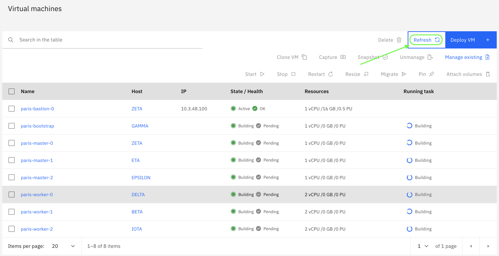

The terraform script has to install a few ansible playbooks.

Wait for the openshift-install command is available (Will be installed eventually after the helper-node gets configured):

```sh
which openshift-install
```

```text
/usr/local/bin/openshift-install
```

Wait for the openstack-upi directory to be created :

```sh
ls ~/openstack-upi/
```

Add the bash completion for both the openshift-install and oc commands :

```sh
oc completion bash > /etc/bash_completion.d/oc
openshift-install completion bash > /etc/bash_completion.d/openshift-install

source /etc/bash_completion.d/oc
source /etc/bash_completion.d/openshift-install

```

* To follow the installion progress of the bootstrap, once in the openstack repository :

```sh
cd ~/openstack-upi/
openshift-install wait-for bootstrap-complete --log-level debug
```

The bootstrap should complete its work within 10 to 20 minutes :

```text
[root@paris-bastion-0 openstack-upi]# openshift-install wait-for bootstrap-complete --log-level debug
DEBUG OpenShift Installer 4.10.11
DEBUG Built from commit 08bc665c50ff867ffd81cfe8f485f2b7c501506b
INFO Waiting up to 20m0s for the Kubernetes API at https://api.paris.edu.ihost.com:6443...
DEBUG Still waiting for the Kubernetes API: an error on the server ("") has prevented the request from succeeding
INFO API v1.23.5+9ce5071 up
INFO Waiting up to 30m0s for bootstrapping to complete...
DEBUG Bootstrap status: complete
INFO It is now safe to remove the bootstrap resources
DEBUG Time elapsed per stage:
DEBUG Bootstrap Complete: 9m58s
DEBUG                API: 1m21s
INFO Time elapsed: 9m58s
```

* To follow the step of the installation progress, open another terminal, then ssh to `10.3.48.100`.

```sh
ssh root@10.3.48.100
```

Check the installation progress :

```sh
cd ~/openstack-upi/
openshift-install wait-for install-complete --log-level debug
```

* Check nodes and cluster operators progress from the bastion :

```sh
cd ~
export KUBECONFIG=~/openstack-upi/auth/kubeconfig
watch -n 15 "oc get clusterversions ; echo ; oc get nodes ; echo ; oc get co"
```

### b) Check the apis and nodes from the bastion's ha_proxy

The status of the api, and nodes can usually be check at the port 9000 of the bastion node. For the ease of this
lab, we have provided a dedicated redirection.

HA proxy to follow the installation, once the bastion is deployed is at <http://haproxy.paris.edu.ihost.com:9007>

* At first, all the other machines will still be red, because not deployed yet.
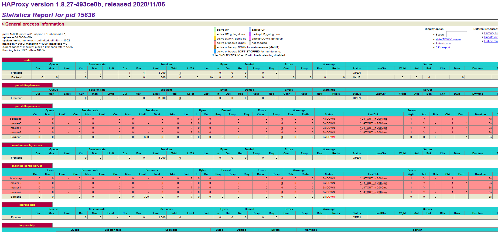

* Then, the bootstrap will be deployed next. It will compose a mini cluster on its own.
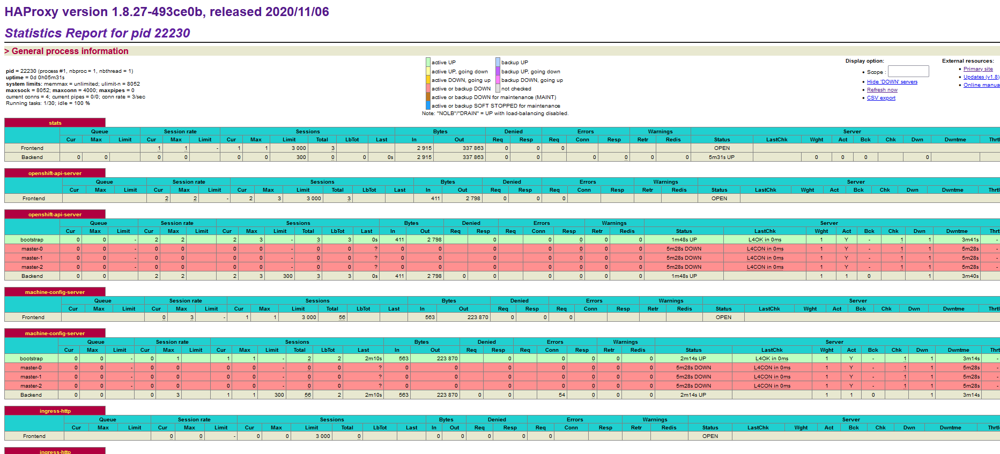

* After the bootstrap come the masters that will join it in the cluster.
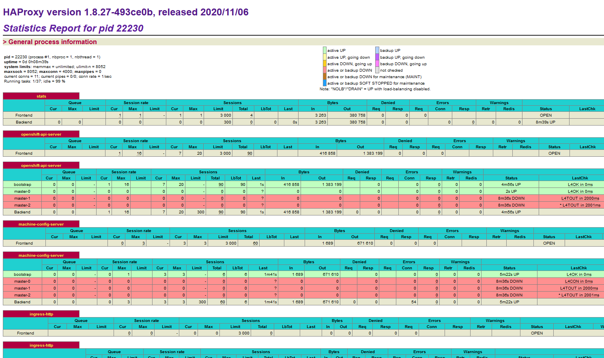

* Then come the workers. Once the masters are all deployed, the bootstrap will terminate, since it is no longer userful.
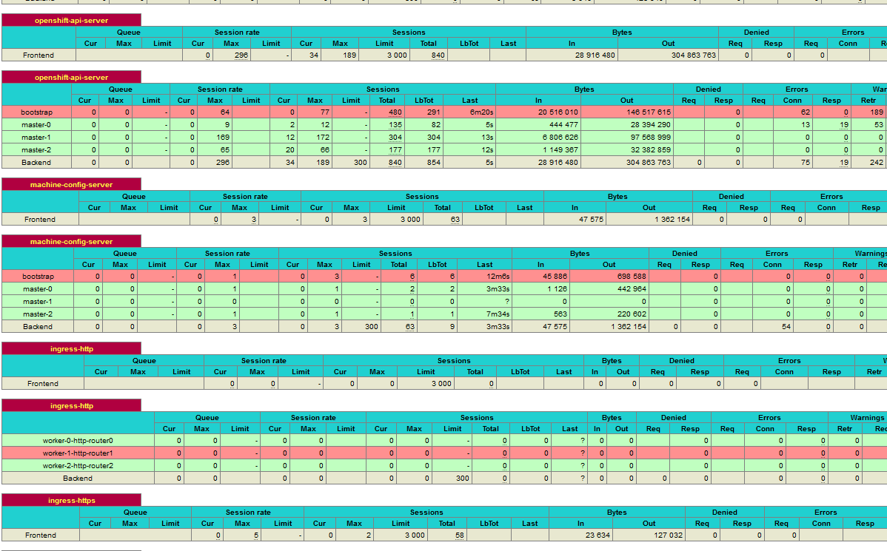

## 3) Check that you can access your new cluster

Once the installation is complete, the terminal where the `openshift-install wait-for install-complete --log-level debug` was run will show up an output similar to :

```text
DEBUG Cluster is initialized
INFO Waiting up to 10m0s for the openshift-console route to be created...
DEBUG Route found in openshift-console namespace: console
DEBUG OpenShift console route is admitted
INFO Install complete!
INFO To access the cluster as the system:admin user when using 'oc', run 'export KUBECONFIG=/root/openstack-upi/auth/kubeconfig'
INFO Access the OpenShift web-console here: https://console-openshift-console.apps.paris.edu.ihost.com
INFO Login to the console with user: "kubeadmin", and password: "your_newly_created_password_here"
DEBUG Time elapsed per stage:
DEBUG Cluster Operators: 23m1s
INFO Time elapsed: 23m1s
```

Note that both the cluster's console and the `kubeadmin` password are provided in this output. You can also retrieve the password from the `kubeadmin-password` file on the bastion.

```sh
cat ~/openstack-upi/auth/kubeadmin-password ; echo
````

The terraform as now completed its work, and has an output similar to:

```text
Apply complete! Resources: 27 added, 0 changed, 0 destroyed.

Outputs:

bastion_ip = 10.3.48.100
bastion_ssh_command = ssh root@10.3.48.100
bootstrap_ip = 10.3.48.19
cluster_id = paris
etc_hosts_entries =
10.3.48.100 api.paris.edu.ihost.com console-openshift-console.apps.paris.edu.ihost.com integrated-oauth-server-openshift-authentication.apps.paris.edu.ihost.com oauth-openshift.apps.paris.edu.ihost.com prometheus-k8s-openshift-monitoring.apps.paris.edu.ihost.com grafana-openshift-monitoring.apps.paris.edu.ihost.com example.apps.paris.edu.ihost.com

install_status = COMPLETED
master_ips = [
  "10.3.48.10",
  "10.3.48.11",
  "10.3.48.12",
]
oc_server_url = https://api.paris.edu.ihost.com:6443
storageclass_name = nfs-storage-provisioner
web_console_url = https://console-openshift-console.apps.paris.edu.ihost.com
worker_ips = [
  "10.3.48.13",
  "10.3.48.14",
  "10.3.48.15",
]
```

You can now login with kubeadmin to the cluster's console : [https://console-openshift-console.apps.paris.edu.ihost.com](
https://console-openshift-console.apps.paris.edu.ihost.com), using the password provided above.

You have to accept the security alert **twice** because the cluster is using a self-signed certificate.
The example below is for Firefox :

First, go to `Advanced`:

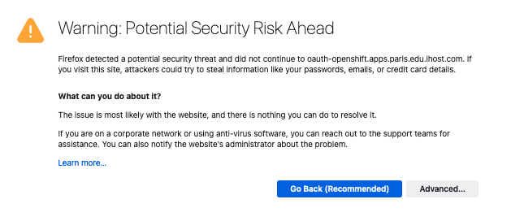

Second, accept the `risk and continue`:

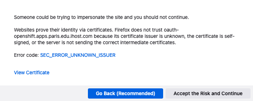

The Openshift cluster's console shows up like:

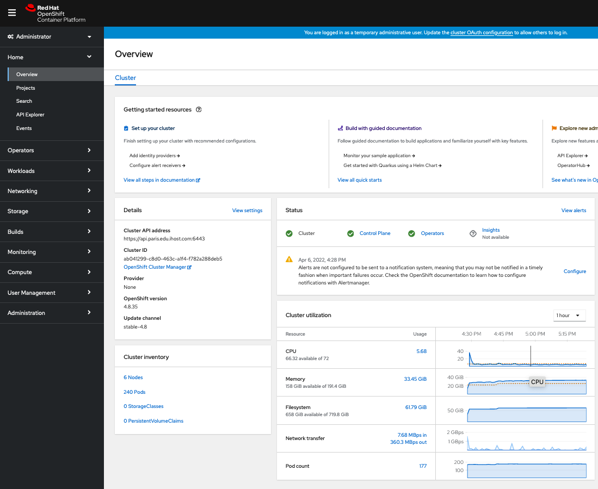

## 4) Extra final step, remove the bootstrap node

### a) Edit the tfvar file

Edit the tfvar file and change the bootstrap count from `1` to `0` :

```text
bootstrap = {instance_type = "master", image_id = "8d20f462-260f-4715-9b95-6a63aad698e3", "count" = 0, fixed_ips = ["10.3.48.19"]}
```

### b) Re-run the terraform script

```sh
terraform apply -var-file paris.tfvars
```

Answer 'yes' when prompted

After the bootstrap node gets properly removed, the [ha_proxy](<http://haproxy.paris.edu.ihost.com:9007>) will show the following :
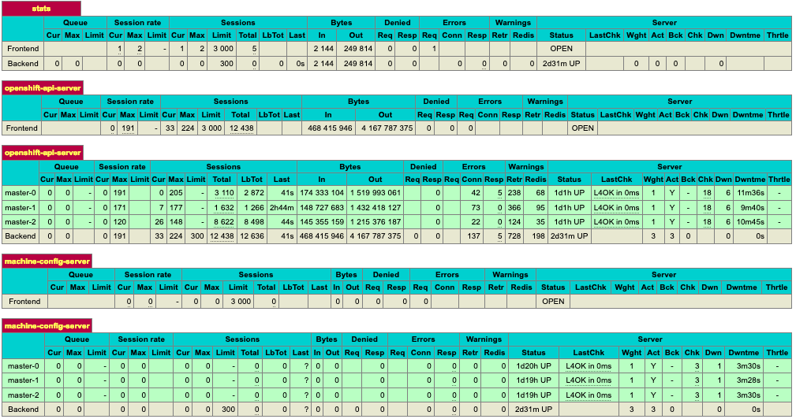

You've completed the demo lab !

> You can find a complete documentation of the Terraform deployment at the [ocp4-upi-powervm
 github](https://github.com/ocp-power-automation/ocp4-upi-powervm#readme)
