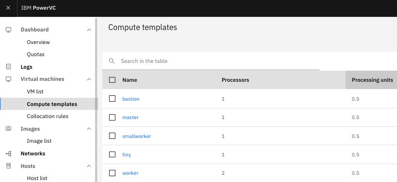
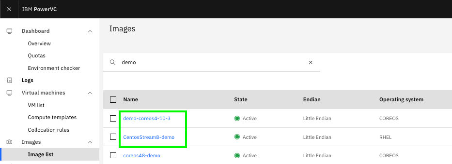
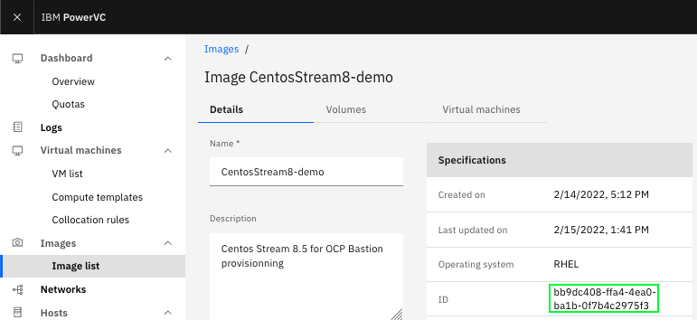
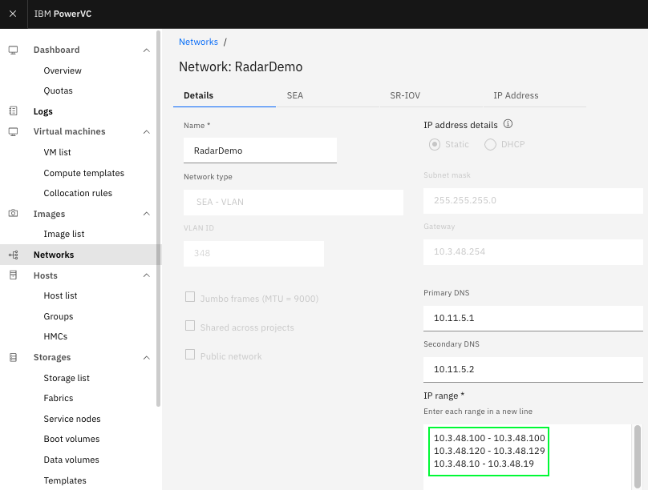

# Parameters in the .tfvars file

This is a limited documentation of the `.tfvar` file. You can find a complete descrition of the tfvar parameters at [The PowerVM upi github repo](https://github.com/ocp-power-automation/ocp4-upi-powervm/blob/master/docs/var.tfvars-doc.md).

## 1) PowerVC credential details

```text
auth_url                    = "https://10.3.47.2:5000/v3/"    # hostname of PowerVC instance, not to be changed
user_name                   = "powervc_login_user_name"       # Provided by Techzone
password                    = "powervc_login_user_password"   # Provided by Techzone
tenant_name                 = "radardemo"                     # PowerVC project name, not to be changed
domain_name                 = "Default"                       # PowerVC domain name, not to be changed

network_name                = "RadarDemo"                     # PowerVC Network, not to be changed
````

## 2) Openshift Cluster Details

The instance_type parameter and image IDs have to be found in those available in PowerVC.

```text
### OpenShift Cluster Details
#
bastion                     = {instance_type    = "bastion",   image_id    = "bb9dc408-ffa4-4ea0-ba1b-0f7b4c2975f3", fixed_ip_v4 = "10.3.48.100"}
bootstrap                   = {instance_type    = "master",    image_id    = "6f0a5409-7d16-4e74-843f-c670070831f8",  "count"   = 1, fixed_ips = ["10.3.48.19"]}
master                      = {instance_type    = "master",    image_id    = "6f0a5409-7d16-4e74-843f-c670070831f8",  "count"   = 3, fixed_ips = ["10.3.48.10", "10.3.48.11", "10.3.48.12"]}
worker                      = {instance_type    = "worker",    image_id    = "6f0a5409-7d16-4e74-843f-c670070831f8",  "count"   = 3, fixed_ips = ["10.3.48.13", "10.3.48.14", "10.3.48.15"]}
```

* The `instance_type` must be chosen within the compute templates name available. Each template provides a certain amount of CPU and memory resources -> Select **Compute templates** in the left pane, it gives the provisionning of the VM.



* The image_id` are those allowed OS images -> **Image list**. The OS images of the VMs must be *CoreOS* for the clusters nodes, and *CENTOS/RHEL* for the bastion node.



Click the `CentosStream8-Demo` image name to retrieve its ID :



* The IP addresses must be picked in the allowed range, select **Networks** in the left pane.


Click in the `RadarDemo` network to check the list of IP adresses allocated to this network :



Here, we can see that the allowed IP's are 10.3.48.100 and 10.3.48.10 to 10.3.48.19.
Make sure you do not change any of them since we have allocated them among a set of IP
adresses accessible through our networks security equipments.

An example for the masters :

```text
master = {instance_type    = "master",    image_id    = "6f0a5409-7d16-4e74-843f-c670070831f8",  "count"   = 3, fixed_ips = ["10.3.48.10", "10.3.48.11", "10.3.48.12"]}
```

Do not change the or `instace_type`, `image_id` or increase the `count` since it could affect the deployment of your cluster. The resources have been carved to fit the demo systems.

## 3) Openshift level

The level of product is customized with the following *tarball* fields. You do not have to change anything, they have been adapted for Openshift 4.10.11

```text
### OpenShift Installation Details

openshift_install_tarball   = "https://mirror.openshift.com/pub/openshift-v4/ppc64le/clients/ocp/4.10.11/openshift-install-linux.tar.gz"
openshift_client_tarball    = "https://mirror.openshift.com/pub/openshift-v4/ppc64le/clients/ocp/4.10.11/openshift-client-linux.tar.gz"
```

../..

```text

release_image_override     = "quay.io/openshift-release-dev/ocp-release:4.10.11-ppc64le"

```

It matches the level of CoreOS image selected in the previous steps.
You may now save the `paris.tfvars` file and return and to the [main road book](install-with-powervc.md)
